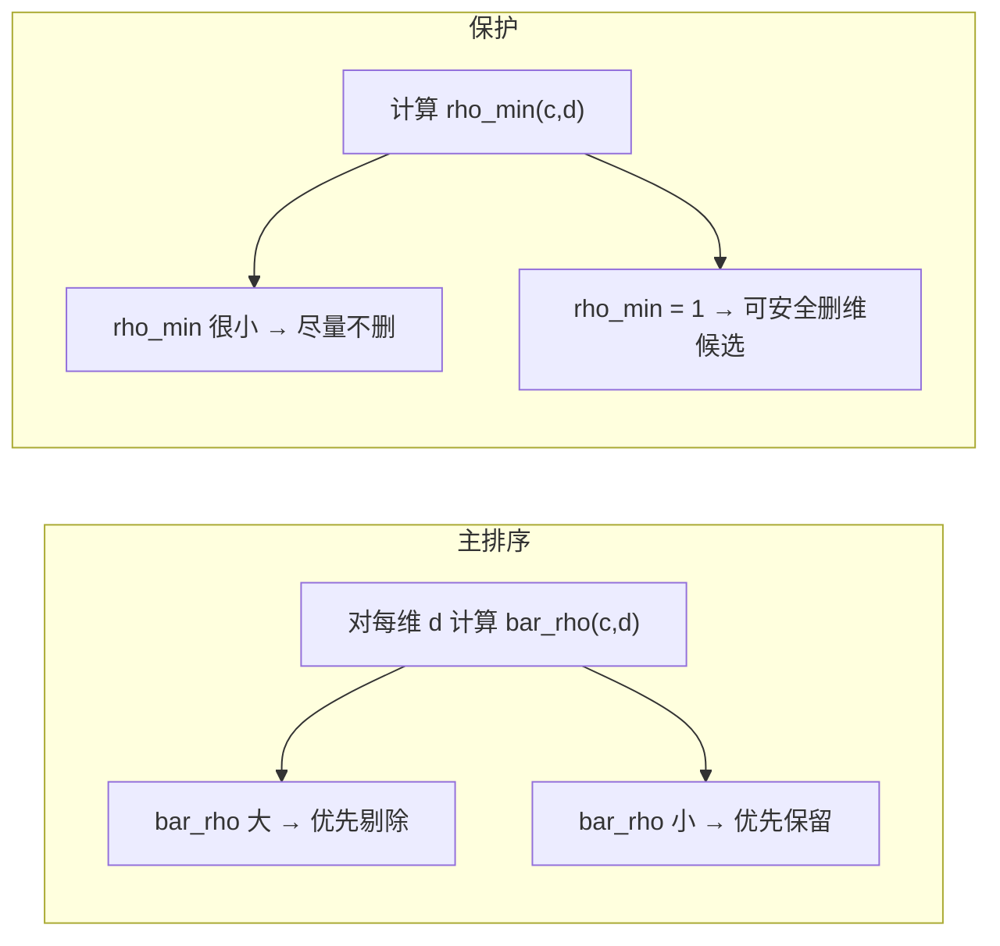
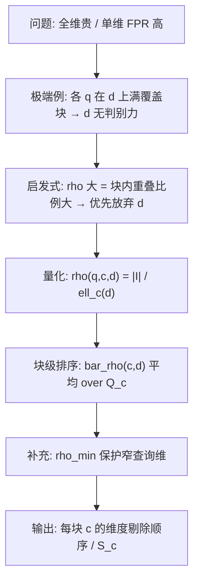

# 按查询负载评估维度过滤贡献度的设计思路

> **Typora 阅读说明**
>
> - 公式使用 `$...$`（行内）与 `$$...$$`（独立一行），请在 **偏好设置 → Markdown → Markdown 扩展语法** 中勾选 **内联公式** 与 **公式块**。
> - Mermaid 流程图需在 **偏好设置 → Markdown → Markdown 扩展语法** 中勾选 **图表**；若仍显示为代码块，请升级 Typora 或使用支持 Mermaid 的预览。
> - 文中「图示」为 **ASCII 文字示意图**（灰色代码块），不是自动生成的矢量图；在等宽字体下最易阅读。
> - **HTML 图示版**（16×16 矩阵、q₁/q₂ 分色阴影）：见 [filter_contribution.html](./filter_contribution.html)，与第 4 节 $d_1,d_2$ 例子对应；用浏览器打开即可查看二维矩形区域。

本文档整理多维范围过滤器在 **按块、按负载选择编码维度** 问题上的讨论结论，不涉及具体代码实现细节。阅读对象：需要在 border chunk 上构建 **子集维度** 多维过滤器、并控制 FPR 与空间/构建开销的研究与实现者。

相关背景见 [workloadAnalyzer.md](./workloadAnalyzer.md)（border 判定、$Q_c$ 等）。

---

## 1. 问题背景：全维 vs 单维的两难

在科学数据等多维范围查询场景下，对每个数据块（chunk）构建过滤器时常见两极：

| 策略 | FPR（相对） | 过滤器空间与构建代价 |
|------|-------------|----------------------|
| 仅用 **一个维度** 编码 | 往往 **偏高** | 较低 |
| 使用 **全部维度** 编码 | 往往 **较低** | 较高 |

自然想法：对 **每个需要过滤器的 border chunk $c$**，根据 **会用到该块过滤器的查询负载** $Q_c$，从全部维度中选一个 **部分维度集合 $S_c$** 来构建多维过滤器，在 **FPR 不明显恶化** 的前提下，尽量降低空间与 `compute_Rangeset` 等构建开销。

后续讨论默认：

- 仅 **border chunk** 需要块上过滤器（与 `process_Queries` 一致）；
- $Q_c$ = 所有使 $(q,c)$ 满足 `inrange && isborderchunk==1` 的查询集合；
- 构建与查询时对 $S_c$ 使用 **同一投影规则**（在 $S_c$ 上计算/查询多维范围 ID）。

---

## 2. 从极端例子得到的直观：何时可以「删维」

### 2.1 设定

固定一个 **border chunk $c$**，考察某一维 $d$。设该块在维度 $d$ 上的取值区间为：

$$
[L_c,\, H_c] \quad\text{（例如 } [0,15]\text{，块长 } \ell_c(d) = H_c - L_c + 1 = 16\text{）}
$$
对 **所有** $q \in Q_c$，将查询在 $d$ 上 **裁剪到块内** 后的区间为 $I(q,c,d)$（与查询路径中对 `q` 的裁剪一致）。

### 2.2 极端情形（满覆盖）

若对 **每一条** $q \in Q_c$ 都有：

$$
I(q,c,d) = [L_c,\, H_c]
$$
即：所有会走该块过滤器的查询，在 $d$ 上都 **铺满整个块**。

**图示（一维，块与查询在 $d$ 上的关系）：**

```
维度 d 上块 c 的取值轴:  |----[ L_c ========== H_c ]----|  例如 [0,15]

查询 q1 在块内裁剪:      |----[********************]----|  全覆盖
查询 q2 在块内裁剪:      |----[********************]----|  全覆盖
                         （* = 查询允许的范围）

块内任意元组 t_d ∈ [L_c,H_c]  →  对任意 q∈Q_c 在维 d 上必满足查询
```

**直观结论：**

- 维 $d$ **无法** 帮助过滤器区分「该块是否可能命中」：凡在块内的点，在 $d$ 上都不会被查询挡在块外；
- 从 $S_c$ 中 **去掉 $d$**（在剩余维上投影构建/查询），**不应引入假阴性**：过滤器在 $d$ 上本就没有排除整块的能力；
- 代价是 **假阳性可能上升**（投影后多维范围 ID 合并变粗），属于用空间换判别力的有意权衡。

> **注意**：这是「删维后语义仍正确」的 **充分条件**（每查询满覆盖），不是「平均覆盖很大」的模糊版本；后者见第 4、5 节。

### 2.3 与「过滤器在做什么」的对应关系

对固定的 $(c, Q_c)$：

> **维 $d$ 有过滤贡献** ⟺ 存在某 $q \in Q_c$，使得 $I(q,c,d)$ 是 $[L_c,H_c]$ 的 **真子集**（查询在 $d$ 上在块内 **变窄**），过滤器才有机会利用 $d$ 上的多维范围 ID 减少「误报整块」。

> **维 $d$ 贡献极低 / 可优先舍弃** ⟺ 对 $Q_c$ 中 **多数或全部** 查询，$I(q,c,d)$ 在块内 **很宽**（接近满块），该维对当前负载 **选择性弱**。

---

## 3. 启发式推广：「重叠占块长比例大 → 优先放弃」

极端例子用 **二元**（满覆盖 / 不满）判断。实际负载中更常见的是 **程度差异**：有的维「几乎满块」，有的维「很窄」。因此推广为 **连续指标** 做 **排序**（而非单独作为严格删维的充要条件）。

### 3.1 单条查询上的重叠比例 $\rho$

对 border 块 $c$、维 $d$、查询 $q \in Q_c$：

1. 块在 $d$ 上的值域：$[L_c, H_c]$，块长 $\ell_c(d) = H_c - L_c + 1$。
2. 查询与块的交集（裁剪后）：

$$
I(q,c,d) = \bigl[\max(q_{\min,d}, L_c),\; \min(q_{\max,d}, H_c)\bigr]
$$

   若 $\max > \min$，则不相交（该 $(q,c)$ 通常不在 $Q_c$ 中）。
3. **重叠比例**：

$$
\rho(q,c,d) = \frac{|I(q,c,d)|}{\ell_c(d)}
$$

   其中 $|I|$ 为离散域上的点数（与实现中整数区间长度一致：$\text{hi}-\text{lo}+1$）。

**图示：**

```
块 c 在维 d:     [0 ——————————————— 15]     ℓ = 16

ρ = 15/16:       [0 ——————————————15)  缺右端一点
                 [*****************·]

ρ = 1:           [0 ——————————————— 15]  满覆盖
                 [******************]

ρ = 2/16:        [0·]                      很窄
                 [**]
```

### 3.2 排序规则（启发式）

对候选维度 $d$：

- $\rho$ **越大** → 查询在块内该维 **越宽** → 该维对 **当前负载** 的判别力 **越弱** → **越优先** 从过滤器编码维度集合 $S_c$ 中 **剔除**；
- $\rho$ **越小** → 存在 **强选择性** 查询 → **越应保留**。

在需保留 $k$ 维（$1 < k < M$）时：按 $\rho$ 从大到小删维，或按 $\rho$ 从小到大保留 top-$k$。

### 3.3 与极端例子的关系

| 情况 | $\rho$ | 与「删维」 |
|------|----------|------------|
| 所有 $q \in Q_c$ 在 $d$ 上满覆盖 | $\rho(q,c,d)=1$ 恒成立 | 对应第 2 节 **可安全删维**（无 FN） |
| 多数查询很宽、少数很窄 | 平均 $\bar\rho$ 可能仍高，但 $\rho_{\min}$ 低 | 见第 5 节：应用 $\rho_{\min}$ 保护 |

---

## 4. 例子：$d_1$ 与 $d_2$ 为何排序不同

### 4.1 题目设定

- 块 $c$ 在 **$d_1$** 与 **$d_2$** 上的取值空间均为 $[0,15]$，$\ell_c(d_1)=\ell_c(d_2)=16$。
- 两条范围查询（块内裁剪后的区间）：
  - $q_1$：$d_1 \to [0,14]$，$d_2 \to [0,15]$
  - $q_2$：$d_1 \to [0,14]$，$d_2 \to [0,1]$
- $Q_c = \{q_1, q_2\}$（均将该块视为 border 且走过滤器）。

### 4.2 逐维计算 $\rho$

| 查询 | $d_1$ 上 $I(q,c,d_1)$ | $\rho(q,c,d_1)$ | $d_2$ 上 $I(q,c,d_2)$ | $\rho(q,c,d_2)$ |
|------|---------------------------|-------------------|---------------------------|-------------------|
| $q_1$ | $[0,14]$，长 15 | $15/16$ | $[0,15]$，长 16 | $1$ |
| $q_2$ | $[0,14]$，长 15 | $15/16$ | $[0,1]$，长 2 | $2/16 = 1/8$ |

**$d_1$ 轴（两条查询形状相同）：**

```
块 [0 ————————————————— 15]

q1: [0 ——————————————— 14·]     ρ = 15/16
q2: [0 ——————————————— 14·]     ρ = 15/16
    （两条都「几乎铺满」，仅缺 15 这一点）
```

**$d_2$ 轴（$q_1$ 满、$q_2$ 极窄）：**

```
块 [0 ————————————————— 15]

q1: [0 ——————————————— 15]     ρ = 1
q2: [0·]                         ρ = 1/8
    （一条满覆盖，一条只在左端窄条）
```

### 4.3 平均重叠比例 $\bar\rho$ 与排序结论

$$
\begin{aligned}
\bar\rho(c,d_1) &= \frac{1}{|Q_c|}\sum_{q\in Q_c}\rho(q,c,d_1)
= \frac{15/16 + 15/16}{2} = \frac{15}{16} \approx 0.94 \\
\bar\rho(c,d_2) &= \frac{1 + 1/8}{2} = \frac{9}{16} \approx 0.56
\end{aligned}
$$
因 $\bar\rho(c,d_1) > \bar\rho(c,d_2)$：

- **$d_1$**：更接近第 2 节极端情形（两条查询在 $d_1$ 上都几乎满块）→ **更适合优先从 $S_c$ 中剔除**；
- **$d_2$**：$q_2$ 在 $d_2$ 上极窄 → 保留 $d_2$ 更利于在过滤器中区分「可能命中 / 很可能不命中」→ **若先删维，FPR 更可能明显上升**。

**二维示意（块内查询矩形在 $(d_1,d_2)$ 上的投影，块为 $[0,15]^2$）：**

```
d2 ↑
15 |  +------------------+     q1: d2 方向拉满
   |  |██████████████████|
   |  |██████████████████|
 1 |  +--+               |     q2: d2 仅 [0,1] 窄条
   |  |██|               |
 0 |  +------------------+----→ d1
     0                 15

q1、q2 在 d1 上均为 [0,14]（高度相近的「横条」）；
在 d2 上 q1 满高度、q2 仅底部窄条 → d2 更有判别力。
```

> **交互式/分色矩阵图**：见 [filter_contribution.html](./filter_contribution.html)（16×16 格，q₁ 蓝、q₂ 橙、交集紫）。

该例子说明：**用负载在块内的「平均宽度」刻画维度贡献，与直觉一致**。

---

## 5. 用 $\bar\rho(c,d)$ 做维度贡献度排序

### 5.1 定义

对 border 块 $c$、维 $d$，设 $Q_c$ 为命中该块且需过滤器的查询集合：

$$
\boxed{
\bar\rho(c,d) = \frac{1}{|Q_c|} \sum_{q \in Q_c} \rho(q,c,d)
}
$$
**贡献度排序（启发式）：**

- **过滤贡献高**（应优先 **保留** 在 $S_c$ 中）：$\bar\rho(c,d)$ **小**；
- **过滤贡献低**（应 **优先放弃**）：$\bar\rho(c,d)$ **大**。

可选：若查询有权重 $w_q$，用加权平均
$\bar\rho_w(c,d) = \sum_{q\in Q_c} w_q\,\rho(q,c,d) / \sum_{q\in Q_c} w_q$。

### 5.2 适用边界

| 用途 | $\bar\rho$ 是否足够 |
|------|----------------------|
| 在 $M$ 维中排序、删到剩 $k$ 维 | **适合** 作为启发式主键 |
| 证明「删维后一定无假阴性」 | **不够**；需第 2 节满覆盖或 $\rho_{\min}=1$ |
| 负载中偶发极窄查询 | 可能平均仍高 → 需 $\rho_{\min}$ 补充（下节） |

---

## 6. 补充：$\rho_{\min}$ 作为保守保护

### 6.1 定义

$$
\boxed{
\rho_{\min}(c,d) = \min_{q \in Q_c} \rho(q,c,d)
}
$$
含义：$Q_c$ 中 **最窄** 的那条查询在该维上的覆盖比例。一条极窄查询即可表明：**该维对至少一条重要查询仍有强过滤价值**。

### 6.2 与 $\bar\rho$ 的分工



| 指标 | 角色 | 典型用法 |
|------|------|----------|
| $\bar\rho(c,d)$ | **主排序键** | 在预算 $k$ 维下决定 **先删谁、后删谁** |
| $\rho_{\min}(c,d)$ | **保守约束 / 次键** | $\rho_{\min}$ 低于阈值则 **禁止删除** 或 **降低删除优先级** |
| $\rho_{\min}=1$ | **安全删维** | 与第 2 节极端例子等价：所有 $q\in Q_c$ 在 $d$ 上满覆盖 |

**在 $d_1,d_2$ 例子上：**

| 维 | $\bar\rho$ | $\rho_{\min}$ | 解读 |
|----|-------------|-----------------|------|
| $d_1$ | $15/16$ 高 | $15/16$ 高 | 主序与保护一致：**可先删 $d_1$** |
| $d_2$ | $9/16$ 中 | $1/8$ **低** | $\bar\rho$ 中等但 $\rho_{\min}$ 暴露 $q_2$ 窄查询 → **不宜先删 $d_2$** |

### 6.3 组合策略示例（设计层，非唯一方案）

1. **安全集**：$D_{\text{safe}} = \{ d \mid \rho_{\min}(c,d) = 1 \}$ → 可优先加入「可删候选」。
2. **保护集**：$D_{\text{keep}} = \{ d \mid \rho_{\min}(c,d) < \tau \}$（如 $\tau=0.5$）→ 删维时 **避开**。
3. **在剩余维上** 按 $\bar\rho$ **从大到小** 删，直到 $|S_c|=k$ 或达到空间预算。

也可使用字典序排序键：先比 $\bar\rho$（大者先删），再比 $-\rho_{\min}$（$\rho_{\min}$ 小者更不应删）。

---

## 7. 反例与常见误区

### 7.1 不能只看「并集很宽」

若 $q_1$ 在 $d$ 上为 $[0,15]$，$q_2$ 为 $[0,7]$，**并集**仍很宽，但 $\rho(q_2,c,d)=1/2$，$\rho_{\min}$ 较低 → **不能** 因「并集覆盖大」就认为可删 $d$。

```
块 [0 ————————————————— 15]

q1: [0 ——————————————— 15]     ρ = 1
q2: [0 —————————— 7]           ρ = 1/2
    并集仍接近满块，但 q2 在 d 上有判别力 → 需 rho_min 保护
```

### 7.2 「平均很大」≠「可证明无假阴性」

$d_1$ 上 $\bar\rho=15/16$ 仍缺端点 $15$；严格无 FN 需 **每条** 查询 $\rho=1$。用 $\bar\rho$ 删维应视为 **接受 FPR 可能略升** 的启发式，而非安全定理。

### 7.3 统计对象必须是 $Q_c$

只对 **会使块 $c$ 走过滤器** 的查询（border 且与块相交）计算 $\rho$；与 $c$ 相交但 **完全覆盖**、不走过滤器的查询 **不应** 进入 $Q_c$。

---

## 8. 思路链条小结



| 阶段 | 核心思想 | 关键公式/条件 |
|------|----------|----------------|
| 极端例子 | 满覆盖 ⇒ 删 $d$ 不损 FN | $I(q,c,d)=[L_c,H_c]$ 对所有 $q\in Q_c$ |
| 启发式推广 | 宽查询多 ⇒ $d$ 不重要 | $\rho(q,c,d)$ 大 ⇒ 优先放弃 |
| $d_1,d_2$ 例子 | 平均宽度区分维 | $\bar\rho(c,d_1)>\bar\rho(c,d_2)$ ⇒ 先删 $d_1$ |
| $\rho_{\min}$ 补充 | 防止误删「偶发窄查询」依赖的维 | $\rho_{\min}$ 小 ⇒ 保留 |

---

## 9. 与工程模块的衔接（概念层）

实现路线（与代码无关的依赖顺序）：

1. **$Q_c$**：对每个 border chunk 收集命中它的查询下标（工作负载分析器层 A）。
2. **$\rho,\ \bar\rho,\ \rho_{\min}$**：在 $Q_c$ 上按块内裁剪计算（层 B，待做）。
3. **$S_c$**：按 $\bar\rho$ / $\rho_{\min}$ 选维，再改 `compute_Rangeset` 与查询侧投影（层 C，待做）。

更完整的 border / $Q_c$ 语义见 [workloadAnalyzer.md](./workloadAnalyzer.md)。

---

## 10. 参考文献档

- [workloadAnalyzer.md](./workloadAnalyzer.md) — border 判定、$Q_c$、与 `process_Queries` 一致性  
- [filter_contribution.html](./filter_contribution.html) — 本思路 HTML 图示版（$d_1,d_2$ 例子 16×16 矩阵）  
- [CLAUDE.md](../CLAUDE.md) — 项目整体过滤器流程与多维范围 ID 概念  

---

*文档版本：整理自维度选维设计讨论；仅描述思路，不绑定具体实现参数（如保留维数 $k$、阈值 $\tau$）。*
